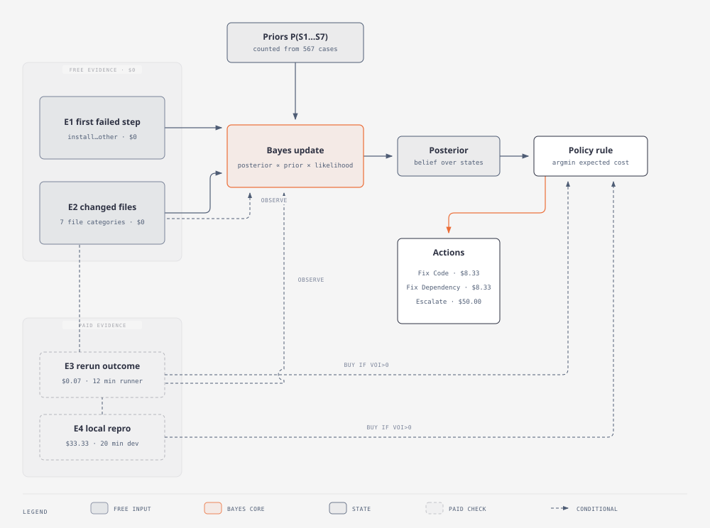
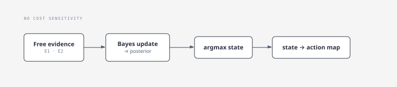
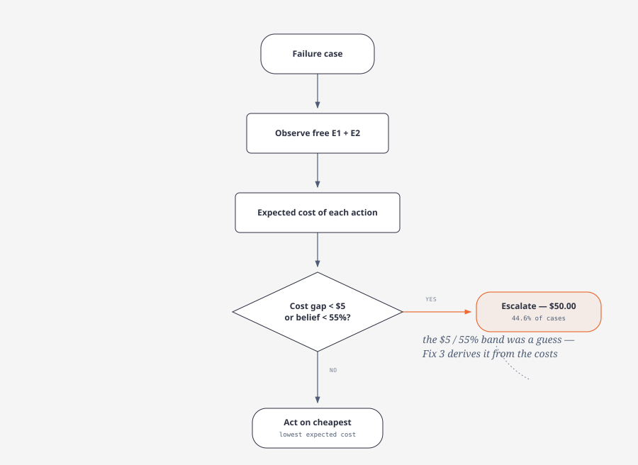
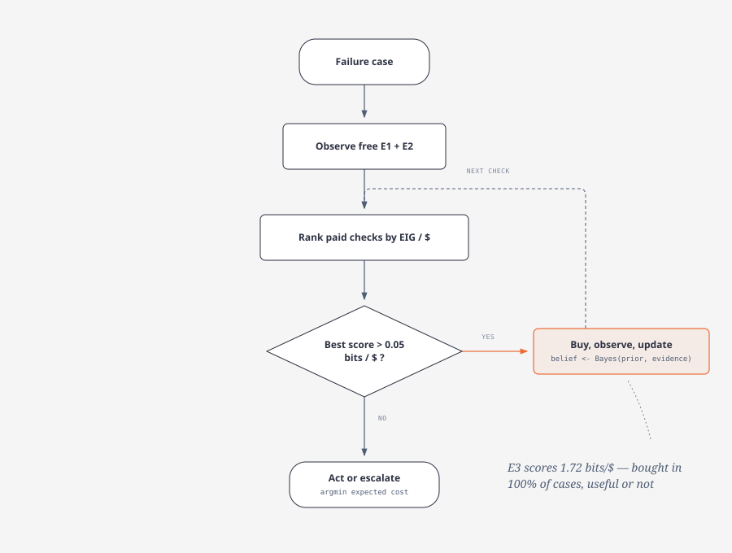
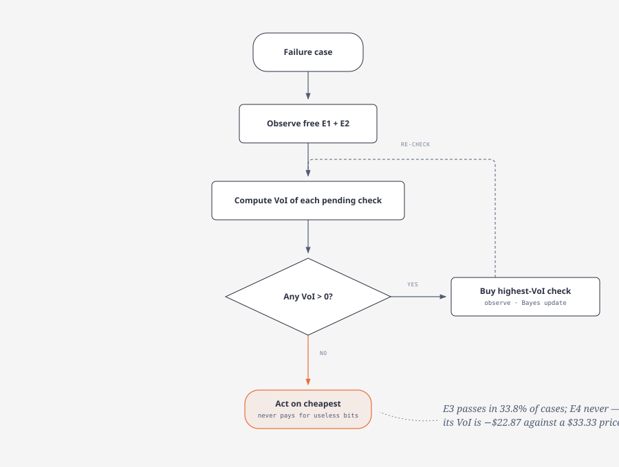
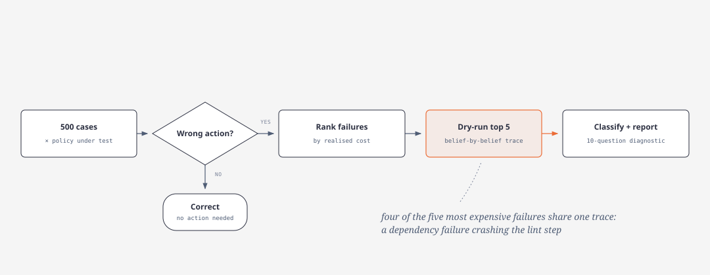

# CI Diagnosis Agent — a policy comparison study

How should an autonomous CI-repair agent decide *when to stop looking and start acting*? This repo answers that with decision theory: five operating policies (P0–P4) are evaluated on 500 reproducible benchmark cases, each paying assumed costs (see [`decisions/costs.md`](decisions/costs.md)) for wrong repairs, unnecessary evidence, and unnecessary human escalation.

All priors, likelihoods, and costs come from [`decisions/`](decisions) and live in [`experiments/constants.py`](experiments/constants.py). Every policy is scored by the same harness ([`experiments/evaluation.py`](experiments/evaluation.py)) on the same cases.

> **Honesty note:** the benchmark cases are *synthetic*, generated by sampling hidden states from the priors and evidence from the same likelihood tables the policies use (`src/generate_benchmark_data.py`). The experiments therefore measure how well each *policy* performs given the assumed model — they cannot validate the likelihoods or cost numbers themselves, which are assumptions, not measurements.

## Results

| Policy | Strategy | Accuracy | Cost / case | Info cost | Escalation |
|---|---|---:|---:|---:|---:|
| **P4 — cost-based VoI** ⭐ | buy evidence only if its *value of information* > 0 | **63.0%** | **$35.01** | $11.83 | 17.2% |
| P1 — belief-only | free evidence → most likely state → its action | 61.6% | $35.57 | $0.00 | 7.4% |
| P3 — info-gain per $ | buy evidence ranked by information gain per dollar | 60.4% | $35.93 | $35.00 | 33.4% |
| P2 — cost threshold | cheapest action, escalate when uncertain | 51.0% | $37.73 | $0.00 | 44.6% |
| P0 — baseline | always the majority action | 47.8% | $43.17 | $0.00 | 0.0% |

**P4 wins**: highest accuracy, lowest cost per case, and it buys the cheap rerun check (E3, $0.07) in only 33.8% of cases. The expensive local reproduction (E4, $33.33) is *never* cost-justified — its value of information never exceeds its price.

### Robustness across seeds

The table above is one benchmark draw (seed 42). Re-running the same policies on independently sampled 500-case benchmarks (seeds 7 and 123, per-case results in [`experiments/results/`](experiments/results)) keeps the ranking intact — P4 is the most accurate policy on every seed:

| Policy | Accuracy (mean ± std) | Cost / case (mean ± std) |
|---|---|---|
| P4 — cost-based VoI | 63.8% ± 0.7% | $34.21 ± 0.57 |
| P1 — belief-only | 60.3% ± 0.9% | $35.96 ± 0.30 |
| P3 — info-gain per $ | 60.0% ± 0.7% | $35.64 ± 0.21 |
| P2 — cost threshold | 50.9% ± 0.4% | $37.53 ± 0.25 |
| P0 — baseline | 49.5% ± 1.2% | $42.01 ± 0.83 |

Reproduce with `python -m experiments.run_seed_variance`; full table incl. escalation rates in [`experiments/results/seed_variance.md`](experiments/results/seed_variance.md).

## How the model works

One Bayesian core is shared by every policy. Beliefs start at the priors, free evidence (E1 pipeline step, E2 changed files) always updates them, and the *policy* decides whether paid evidence is worth buying and when to commit to an action.



The cost model is assumed, not measured (full derivation in [`decisions/costs.md`](decisions/costs.md)): a wrong repair costs **$75.07** (vs **$8.33** for the right one) and escalating to a human costs a flat **$50.00** — those numbers are what make "gather more evidence?" an economic question, not a guess.

## The policies

### P0 — majority baseline

No evidence, no belief: always predict the most common action, computed from the same 500 evaluation cases. That makes it a slightly optimistic floor — but it exists to prove the other policies beat doing nothing. *(Nothing to draw — it has no logic.)*

### P1 — belief-only

Pure Bayesian reasoning with no cost sensitivity: update on the free evidence, pick the most likely state, do whatever that state's action map says.



### P2 — expected-cost threshold

Still free evidence only, but the action now minimises expected cost, and a guard diverts close calls to a human: escalate when the two cheapest actions are within **$5.00** of each other or no state reaches **55%** belief.



### P3 — information gain per dollar

Buys paid evidence by a *heuristic*: rank remaining checks by expected information gain ÷ cost, buy while the score beats 0.05, stop once the decision leaves the uncertain band. The loop below is shared with Fix 3.



The heuristic's blind spot: it counts *information*, not *money*. E3 in all 500 cases (even when the extra belief changes nothing) is why P3 pays $35.00 of information cost vs P4's $11.83.

### P4 — cost-based value of information ⭐

The rigorous policy. For each candidate check it asks a dollar question:

> VoI(E) = EC(best action now) − (cost of E + expected EC after observing E)

and buys only when **VoI > 0** — information has value only when it can change the action, and that change must save more than the check costs.



Result: E3 bought in 33.8% of cases, E4 in **0%** — no belief update is worth $33.33 under this cost structure.

## Experiments

Each experiment is a standalone script; run them from the repo root with `venv/bin/python -m experiments.<name>` (or `python -m …` from your environment).

### 1. Policy comparison — `run_policy_comparison.py`

Evaluates P0–P4 with the shared harness, prints the headline table, and saves the chart below to `experiments/reports/`.

### 2. Failure analysis — `run_failure_analysis.py`

Collects every misclassified case per policy and documents the five most expensive ones with a dry-run trace of the belief updates, writing one markdown file per policy to `experiments/failures/`. P4 misclassifies 185 of 500 cases (63.0% accuracy) — the reports show the five most expensive failure cases with their exact belief trajectories.



### 3. Fix 1 — what if local reproduction got cheap? `run_e4_cost_whatif.py`

E4's $33.33 price is developer time; automation could cut it to **$0.10**. The override is injected into the policy (no global constants are mutated).

| | Accuracy | Cost / case | E4 acquired |
|---|---:|---:|---:|
| P4 baseline | 63.0% | $35.01 | 0 cases |
| **E4 = $0.10** | **68.4%** | **$32.10** | **191 / 500** |

A cheap local repro changes the answer completely: the policy buys it in 38% of cases, gaining 5.4 points of accuracy and $2.91 per case.

### 4. Fix 2 — what if dependency failures clear on rerun? `run_e3_likelihood_whatif.py`

A what-if on beliefs rather than prices: suppose `P(pass on rerun | S3)` were 0.40 instead of 0.15 (flaky mirrors, restored caches). Both runs use the corrected E3 benchmark mapping — this experiment also surfaced a real data bug: the benchmark stores the rerun outcome under `evidence_e3_rerun_outcome`, which the original notebook never read, so E3 silently updated nothing.

| | Accuracy | E3 acquired | Escalation |
|---|---:|---:|---:|
| Original likelihood (0.15/0.85) | 63.0% | 33.8% | 17.2% |
| **Optimistic likelihood (0.40/0.60)** | **61.6%** | **70.8%** | 8.6% |

Believing reruns fix dependencies makes the policy *worse under the simulated benchmark*: it buys E3 twice as often and acts over-confidently (escalation drops to 8.6%, accuracy drops 1.4 points). Mis-specified beliefs cost more than the extra evidence.

### 5. Fix 3 — thresholds derived from costs, not guessed — `run_derived_threshold_policy.py`

P2's thresholds ($5 gap, 55% confidence) were guesses. They can be derived from the costs instead: with a wrong fix wasting $25.07 and a missed fix wasting $41.67, the break-even belief is

> p* = 25.07 / (25.07 + 41.67) = **0.3756**

Perturbing each cost by ±10% moves p* only within [0.30, 0.45], so the rule is not knife-edge. The policy gathers evidence one piece at a time (highest IG/$ first, free evidence always first) until a fix action's correct-belief mass clears p*.

| | Accuracy | Cost / case | Escalation |
|---|---:|---:|---:|
| P4 (VoI) | 63.0% | $35.01 | 17.2% |
| **Fix 3 (derived p*)** | **63.8%** | $39.55 | 7.0% |

Highest accuracy and the least human escalation — but a higher total cost, because the IG/$ evidence rule (unlike P4's VoI rule) still buys the $33.33 local repro in 74 cases where the belief gain never pays for itself. The threshold layer is an improvement; the evidence-buying layer still needs VoI.

## Project structure

```
.
├── AGENTS.md                        # coding conventions for agents
├── experiments/
│   ├── constants.py                 # priors, likelihoods, costs (from decisions/)
│   ├── policies/                    # one module per decision rule
│   │   ├── base.py                  #   Policy interface + shared Bayes math
│   │   ├── baseline.py              #   P0
│   │   ├── belief_only.py           #   P1
│   │   ├── expected_cost_threshold.py  # P2
│   │   ├── info_gain.py             #   P3
│   │   ├── value_of_information.py  #   P4
│   │   └── derived_threshold.py     #   Fix 3 policy
│   ├── evaluation.py                # benchmark loading + shared evaluate/summarize
│   ├── run_policy_comparison.py
│   ├── run_failure_analysis.py
│   ├── run_e4_cost_whatif.py
│   ├── run_e3_likelihood_whatif.py
│   ├── run_derived_threshold_policy.py
│   ├── failures/                    # generated per-policy failure reports
│   └── reports/                     # generated charts (gitignored)
├── notebooks/agent.ipynb            # original narrative notebook (archived)
├── data/benchmark_data/             # 500 benchmark cases (gitignored)
├── decisions/                       # decision + cost records
└── src/                             # data generation / reproducibility utilities
```

## Setup

```bash
python -m venv venv
source venv/bin/activate
pip install -r requirements.txt
python -m experiments.run_policy_comparison
```

## Future validation

- Validate cost assumptions against production data; monitor repair outcomes to refine priors and likelihoods.
- A/B test P4 against P1 in live CI runs; collect feedback on the 17.2% escalation rate.
- Combine the winners: Fix 3's derived threshold for acting + P4's VoI rule for buying evidence.
