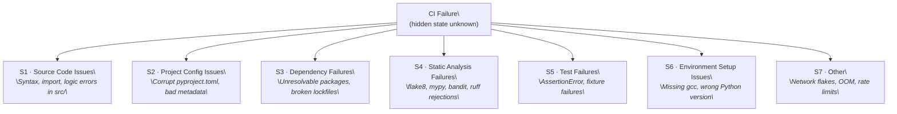
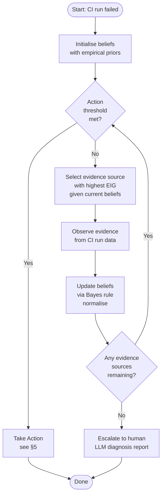
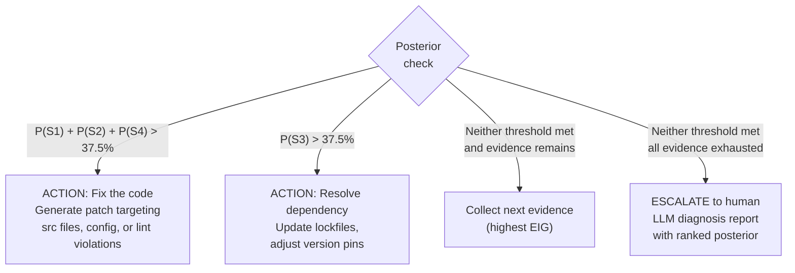
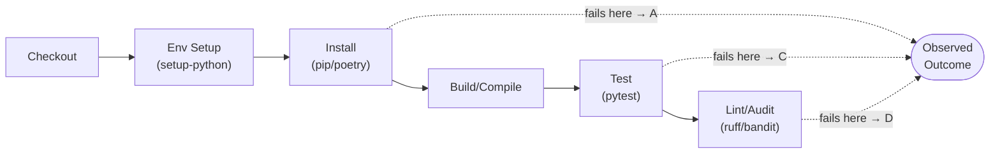
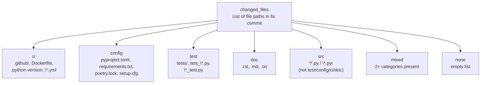
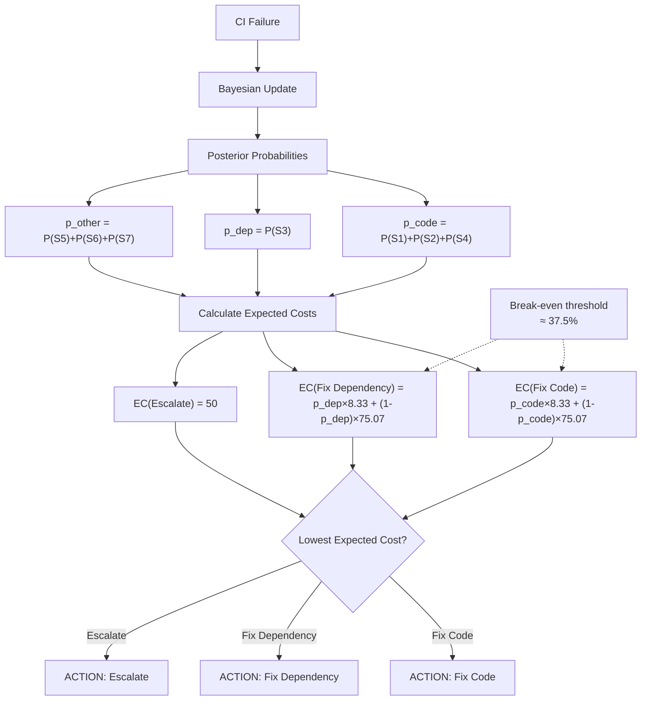

_       
# Probability Decision Record — CI Failure Diagnosis Agent (Final)

> **Date:** 2026-08-24

> **Dataset:** `ci_repair_bench_disambiguated.parquet` — 567 Python CI repair cases, 0 nulls

> **Status:** All priors and likelihoods are empirically grounded from this dataset unless explicitly noted otherwise.

---

## 1. Problem Statement

A GitHub Actions CI run has failed. The agent must identify the **root cause category** (hidden state) of the failure. The true root cause is not directly observable — the agent can only observe indirect signals (evidence). Using Bayes' theorem, the agent updates its beliefs over hidden states as each evidence source is queried, then takes a targeted action when sufficiently confident.

**Bayes' Theorem:**

```

P(D | theta) \* P(theta)

P(theta | D) = ─────────────────────────

P(D)

```

- `P(theta)` — **Prior**: initial belief about root cause category before seeing any evidence

- `P(D | theta)` — **Likelihood**: probability of observing evidence `D` given the true cause is `theta`

- `P(theta | D)` — **Posterior**: updated belief after observing `D`

- `P(D)` — **Marginal likelihood**: normalisation constant (sum of all numerators)

**Update rule in code:**

```python

*# For each state s, multiply prior by likelihood of observed outcome*

unnormalised[s] = prior[s] \* likelihood[s][observed_outcome]

*# Normalise so beliefs sum to 1*

Z = sum(unnormalised.values())

posterior[s] = unnormalised[s] / Z

```

---

## 2. Hidden States

Seven mutually exclusive root cause categories. Every CI failure belongs to exactly one.

Hidden states are mapped from the original dataset error_type column.



| # | Hidden State | Short Description |
|---|---|---|
| S1 | **Source Code Issues** | Syntax, import, or logic errors in application source files (`src/`). Break the build phase or cause isolated logic bugs during unit testing. |
| S2 | **Project Config Issues** | Malformed project-level metadata: corrupt `pyproject.toml`, missing `README.md`, broken package build configuration. |
| S3 | **Dependency Failures** | Missing packages, unresolvable version constraints, broken lockfiles, or missing third-party dependencies during package resolution and installation. |
| S4 | **Static Analysis Failures** | Rejections from automated quality/security/formatting tools: `flake8`, `mypy`, `bandit`, `black`, `ruff`, coverage threshold checks. |
| S5 | **Test Failures** | Explicit assertion mismatches, unexpected exceptions, or fixture setup failures within `tests/` during `pytest`/`unittest` execution. |
| S6 | **Environment Setup Issues** | Runner infrastructure defects: missing OS-level headers (`gcc`, `libpq-dev`), incorrect Python runtime version, image provisioning failures. |
| S7 | **Other** | Ambiguous, non-deterministic, or external failures: transient network flakes, API rate limits, disk space shortages, OOM kills (exit 137), permission issues. |

---

## 3. Priors

**Source:** Directly counted from `primary_hidden_state` column in `ci_repair_bench_disambiguated.parquet`.

**Method:** `count / total_rows`. No assumptions, no smoothing, no external literature.

| # | Hidden State | Count | Prior P(S) |
|---|---|---|---|
| S1 | Source Code Issues | 15 | **0.0265** |
| S2 | Project Config Issues | 33 | **0.0582** |
| S3 | Dependency Failures | 177 | **0.3122** |
| S4 | Static Analysis Failures | 236 | **0.4162** |
| S5 | Test Failures | 66 | **0.1164** |
| S6 | Environment Setup Issues | 32 | **0.0564** |
| S7 | Other | 8 | **0.0141** |
| | **TOTAL** | **567** | **1.0000** |

**Prior entropy:** `H(S) = -sum_i [ P(Si) \* log2(P(Si)) ] = 2.110 bits`

**Prior distribution — bar chart:**

```

Prior P(S)

───────────────────────────────────────────────────────────

S4 Static Analysis  ████████████████████████████████  41.6%

S3 Dependency       ████████████████████████          31.2%

S5 Test Failures    █████████                         11.6%

S2 Project Config   ████                               5.8%

S6 Env Setup        ████                               5.6%

S1 Source Code      ██                                 2.6%

S7 Other            █                                  1.4%

───────────────────────────────────────────────────────────

```

**Key observation:** S4 and S3 together account for 72.8% of all cases. This skew is real — it reflects what actually breaks Python CI in production open-source projects.

**Assumption:** These priors represent failure frequency in open-source Python CI workflows. They may not transfer to private enterprise codebases (stricter pre-commit hooks reduce S4) or to non-Python repositories.

---

## 4. Agent Loop



**Pseudocode:**

```

INITIALISE beliefs <- priors P(S)

LOOP:

IF action threshold met:

TAKE ACTION  (see Section 5)

BREAK

evidence <- SELECT source with highest EIG given current beliefs

observation <- OBSERVE that evidence source from CI run data

FOR each state s:

unnorm[s] = beliefs[s] \* likelihood[s][observation]

Z = sum(unnorm.values())

beliefs[s] = unnorm[s] / Z       # normalise

AFTER all evidence collected with no action threshold met:

ESCALATE to human with ranked posterior + diagnosis report

```

**Evidence selection:** At each step the agent computes EIG for every remaining (unobserved) source under the current posterior and queries the highest. This is greedy one-step lookahead — not globally optimal but computationally tractable.

---

## 5. Action Policy



**Threshold rationale:**

| Threshold | Value | Reason |
|---|---|---|
| Fix the code: `P(S1+S2+S4)` | > 37.5% | S1/S2/S4 fixes are local and safe — a wrong patch can be reverted cheaply |
| Resolve dependency: `P(S3)` | >37.5% | Dependency changes affect all downstream consumers — higher bar before acting |
| S5, S6, S7 | always escalate | Test logic needs domain knowledge; env issues need infra access; Other is too ambiguous |

>

> ```

> best_action = argmin over actions:

>                   sum over states s of [ P(s | D) \* C(action, s) ]

> ```

---

## 6. Evidence Source E1 — Which Pipeline Step Failed First

### What it means

The CI pipeline runs steps in sequence. The step that fails \*first\* reveals which phase the root cause manifested in. Because each phase gates the next (install → build → test → lint), the earliest failure is the strongest structural signal for root cause.



### How to extract from dataset

**Dataset column:** `failed_jobs` — type `List[Struct{job_name: String, steps: List[String]}]`

**Extraction rule:** Take `failed_jobs[0].steps[0]` — the first step of the first failed job. Lowercase and match against buckets in priority order:

| Bucket | Keywords (substring match, case-insensitive) |
|---|---|
| **A — Install** | `install`, `pip`, `poetry`, `conda`, `requirements`, `setup-python`, `dependencies` |
| **B — Build/Compile** | `build`, `compile`, `import`, `py_compile` |
| **C — Test** | `test`, `pytest`, `unittest`, `coverage` |
| **D — Static Analysis** | `lint`, `flake8`, `black`, `mypy`, `bandit`, `ruff`, `format`, `pre-commit`, `audit`, `type` |
| **E — Workflow/Environment** | `checkout`, `setup`, `provision`, `yaml`, `job`, `environment` |
| **F — Other/Ambiguous** | (remainder: `tox`, `isort`, `pyright`, `yapf`, `codestyle`, etc.) |

**Assumption:** First-failed-step = earliest failure = root cause phase. Breaks down for parallel jobs — the extraction rule picks an arbitrary job, introducing noise.

### Evidence Outcomes

Six mutually exclusive, exhaustive outcomes: **A · B · C · D · E · F**

### Likelihood Table

**Method:** Cross-tabulation of `primary_hidden_state` × step bucket (567 rows). Laplace add-1 smoothing applied to all cells. Rows re-normalised to sum to 1.

**Why Laplace smoothing?** Without it, `P(A | S1 Source Code) = 0/15 = 0` — a permanent zero that would wipe out S1 forever the moment step A is observed. Adding k=1 pseudo-count per cell prevents this while barely changing high-count cells (e.g., 156 → 157 for D|S4).

**Smoothed likelihood table `P(step | state)`:**

| Hidden State | A | B | C | D | E | F |
|---|---|---|---|---|---|---|
| S1 Source Code Issues | 0.0476 | 0.0952 | 0.4762 | 0.1429 | 0.0952 | 0.1429 |
| S2 Project Config Issues | 0.2308 | 0.0256 | 0.4359 | 0.0769 | 0.0769 | 0.1538 |
| S3 Dependency Failures | 0.1694 | 0.0164 | 0.4426 | 0.3279 | 0.0164 | 0.0273 |
| S4 Static Analysis Failures | 0.0248 | 0.0083 | 0.0785 | **0.6488** | 0.0248 | 0.2149 |
| S5 Test Failures | 0.0417 | 0.0417 | **0.6528** | 0.0417 | 0.0556 | 0.1667 |
| S6 Environment Setup Issues | 0.0526 | 0.0526 | **0.6842** | 0.0789 | 0.0526 | 0.0789 |
| S7 Other | 0.1429 | 0.0714 | **0.5714** | 0.0714 | 0.0714 | 0.0714 |

**Raw empirical percentages (pre-smoothing):**

| Hidden State | A | B | C | D | E | F | n |
|---|---|---|---|---|---|---|---|
| S1 Source Code Issues | 0.000 | 0.067 | 0.600 | 0.133 | 0.067 | 0.133 | 15 |
| S2 Project Config Issues | 0.242 | 0.000 | 0.485 | 0.061 | 0.061 | 0.152 | 33 |
| S3 Dependency Failures | 0.169 | 0.011 | 0.452 | 0.333 | 0.011 | 0.023 | 177 |
| S4 Static Analysis Failures | 0.021 | 0.004 | 0.076 | **0.661** | 0.021 | 0.216 | 236 |
| S5 Test Failures | 0.030 | 0.030 | **0.697** | 0.030 | 0.045 | 0.167 | 66 |
| S6 Environment Setup Issues | 0.031 | 0.031 | **0.781** | 0.063 | 0.031 | 0.063 | 32 |
| S7 Other | 0.125 | 0.000 | **0.875** | 0.000 | 0.000 | 0.000 | 8 |

**Dominant signal per outcome — heatmap (H=high, M=medium, L=low):**

```

Outcome  │  S1    S2    S3    S4    S5    S6    S7

─────────┼──────────────────────────────────────────

A     │   L     H     M     L     L     L     M

B     │   M     L     L     L     L     L     L

C     │   H     H     H     L     H     H     H   ← weak (too broad)

D     │   M     L     M    [H]    L     L     L   ← strong for S4

E     │   M     M     L     L     L     L     L

F     │   M     H     L     M     H     L     L

```

### Key Observations

1. **D is a strong positive signal for S4** — 66.1% of Static Analysis Failures first fail at a lint/format step. Observing D concentrates beliefs heavily on S4.

2. **C dominates 5 of 7 states** — Makes C a weak discriminator. Many CI setups surface install/build errors inside the test runner job name (e.g., named "Run tests"), not a dedicated install step.

3. **F captures 21.6% of S4** — Tools like `isort`, `yapf`, `tox`, `pyupgrade` are static analysis tools not in the D keyword list. Expanding that list is a V2 improvement.

4. **S3 shows D=33.3%** — Many dependency failures surface at import time during pytest collection, not during `pip install`. E1 alone cannot cleanly separate S3 from S4.

### EIG for E1

**Expected Information Gain** = how many bits of uncertainty E1 removes on average.

```

EIG(E1) = H(S) - sum_outcome [ P(outcome) \* H(S | outcome) ]

= 2.110 - 1.752

= 0.358 bits

```

| Outcome | P(outcome) | H(S given outcome) | Entropy drop |
|---|---|---|---|
| A — Install | 0.0877 | 1.8273 | +0.28 bits |
| B — Build | 0.0214 | 2.6370 | -0.53 bits (increases uncertainty) |
| C — Test | 0.3315 | 2.2977 | -0.19 bits (increases uncertainty) |
| D — Static Analysis | **0.3910** | **1.1878** | **+0.92 bits** |
| E — Workflow/Env | 0.0329 | 2.5468 | -0.44 bits (increases uncertainty) |
| F — Ambiguous | 0.1356 | 1.6655 | +0.44 bits |

D is overwhelmingly the most informative outcome. B, C, and E \*increase\* posterior entropy because they are evenly spread across states.

---

## 7. Evidence Source E2 — Changed Files in the Fix Commit

### What it means

The files changed between the failing commit (`sha_fail`) and the fixing commit (`sha_success`) reveal the category of the fix. A fix touching only `.py` source files implies a source code or lint problem; a fix touching `pyproject.toml` implies config or dependency issues; a fix touching many file types at once implies a multi-component problem.

**Key framing:** We observe the \*fix diff\*, not the \*failure diff\*. In live agent use this corresponds to the diff between the head commit and the last known green commit on the same branch — obtainable from GitHub API.



### How to extract from dataset

**Dataset column:** `changed_files` — type `List[String]`

**File classification rule (applied per file, priority order):**

| Category | Rule |
|---|---|
| **ci** | Path contains `.github/` OR filename in `Dockerfile\*`, `.python-version`, `.env`, `tox.ini` OR ext in `.yaml`, `.yml`, `.sh` |
| **config** | Filename in `pyproject.toml`, `requirements\*.txt`, `poetry.lock`, `uv.lock`, `Pipfile\*`, `setup.cfg`, `setup.py`, `pytest.ini`, `mypy.ini` OR ext in `.toml`, `.cfg`, `.in` |
| **test** | Path contains `/test` or `/tests/` OR filename matches `test_\*` or `\*_test.py` |
| **doc** | Ext in `.rst`, `.md`, `.txt` (non-requirements) |
| **src** | Ext in `.py` or `.pyi` (not matched above) |
| **other** | Anything else — merged into `mixed` |

**Row-level rule:** single category throughout → that category; 2+ categories → `mixed`; empty list → `none`.

### Evidence Outcomes

Seven mutually exclusive, exhaustive outcomes: **src · test · config · ci · doc · mixed · none**

### Likelihood Table

**Method:** Cross-tabulation of `primary_hidden_state` × file category (567 rows). `other` merged into `mixed`. Laplace add-1 smoothing. Rows re-normalised.

**Smoothed likelihood table `P(file_cat | state)`:**

| Hidden State | src | test | config | ci | doc | mixed | none |
|---|---|---|---|---|---|---|---|
| S1 Source Code Issues | **0.4091** | 0.1818 | 0.0455 | 0.0455 | 0.0455 | 0.2273 | 0.0455 |
| S2 Project Config Issues | 0.1250 | 0.1000 | 0.0750 | 0.0250 | 0.0250 | **0.6000** | 0.0500 |
| S3 Dependency Failures | 0.2011 | 0.0272 | 0.0272 | 0.0109 | 0.0054 | **0.7228** | 0.0054 |
| S4 Static Analysis Failures | **0.5309** | 0.0947 | 0.0123 | 0.0041 | 0.0082 | 0.3457 | 0.0041 |
| S5 Test Failures | 0.2192 | **0.3151** | 0.0137 | 0.0137 | 0.0137 | 0.4110 | 0.0137 |
| S6 Environment Setup Issues | **0.3590** | 0.0769 | 0.0256 | 0.0256 | 0.0256 | **0.4615** | 0.0256 |
| S7 Other | 0.0667 | **0.4000** | 0.0667 | 0.0667 | 0.0667 | 0.2667 | 0.0667 |

**Raw empirical percentages (pre-smoothing):**

| Hidden State | src | test | config | ci | doc | mixed | none | n |
|---|---|---|---|---|---|---|---|---|
| S1 Source Code Issues | **0.533** | 0.200 | 0.000 | 0.000 | 0.000 | 0.267 | 0.000 | 15 |
| S2 Project Config Issues | 0.121 | 0.091 | 0.061 | 0.000 | 0.000 | **0.697** | 0.030 | 33 |
| S3 Dependency Failures | 0.203 | 0.023 | 0.023 | 0.006 | 0.000 | **0.746** | 0.000 | 177 |
| S4 Static Analysis Failures | **0.542** | 0.093 | 0.008 | 0.000 | 0.004 | 0.352 | 0.000 | 236 |
| S5 Test Failures | 0.227 | **0.333** | 0.000 | 0.000 | 0.000 | 0.439 | 0.000 | 66 |
| S6 Environment Setup Issues | 0.406 | 0.063 | 0.000 | 0.000 | 0.000 | **0.531** | 0.000 | 32 |
| S7 Other | 0.000 | **0.625** | 0.000 | 0.000 | 0.000 | 0.375 | 0.000 | 8 |

**Dominant signal per outcome:**

```

Outcome  │  S1    S2    S3    S4    S5    S6    S7

─────────┼──────────────────────────────────────────

src    │  [H]    L     M    [H]    M     M     L   ← strong for S1 & S4

test   │   M     L     L     L    [H]    L    [H]

config │   L     M     L     L     L     L     L   ← too sparse

ci     │   L     L     L     L     L     L     L   ← too sparse

doc    │   L     L     L     L     L     L     L   ← too sparse

mixed  │   L    [H]   [H]    M     H     H     M   ← weak (too broad)

none   │   L     L     L     L     L     L     L   ← near zero everywhere

```

### Key Observations

1. **`mixed` dominates for S2 and S3** — Dependency fixes typically touch `poetry.lock` + `src/` files simultaneously. This limits E2's power for those states.

2. **`src` is the strongest positive signal for S4** — 54.2% of Static Analysis fixes only modify `.py` source files (the developer fixed the lint violation in the code).

3. **`config` and `ci` are too sparse to be reliable** — Only 8 pure-config rows and 1 pure-ci row in 567 rows. These outcomes are almost entirely determined by Laplace smoothing, not data.

4. **`none` is near-zero for all states** — Every repair in the benchmark changes at least one file. This outcome carries almost no signal.

### EIG for E2

```

EIG(E2) = H(S) - sum_outcome [ P(outcome) \* H(S | outcome) ]

= 2.110 - 1.937

= 0.173 bits   (at prior)

EIG(E2 | after observing E1=D) = 1.033 bits   (see §9 worked example)

```

| Outcome | P(outcome) | H(S given outcome) | Entropy drop |
|---|---|---|---|
| src | **0.3486** | 1.6721 | +0.44 bits |
| test | 0.1052 | 2.2044 | -0.09 bits |
| config | 0.0232 | 2.3909 | -0.28 bits |
| ci | 0.0117 | 2.6867 | -0.58 bits |
| doc | 0.0117 | 2.6857 | -0.58 bits |
| mixed | **0.4881** | 1.9926 | +0.12 bits |
| none | 0.0115 | 2.7253 | -0.62 bits |

E2 is weak at the prior (only 0.17 bits) but becomes highly valuable \*after\* E1 has concentrated beliefs — its EIG jumps to 1.03 bits after observing E1=D.

---

## 8. Evidence Source Summary and Query Order

| Evidence | Dataset Column | EIG at prior | Default Order |
|---|---|---|---|
| E1 — Pipeline Step | `failed_jobs` | **0.358 bits** | 1st |
| E2 — Changed Files | `changed_files` | 0.173 bits | 2nd |

**Excluded:** `error_type` — this column is the direct source used to derive `primary_hidden_state`. Using it as evidence would be data leakage.

---

## 9. Full Bayesian Update Example

**Scenario:** A CI run fails. Agent queries E1 first, then E2.

### Step 0 — Prior beliefs

```

State                      P(S)

──────────────────────────────────

S4 Static Analysis        0.4162  ████████████████████

S3 Dependency             0.3122  ███████████████

S5 Test Failures          0.1164  █████

S2 Project Config         0.0582  ██

S6 Env Setup              0.0564  ██

S1 Source Code            0.0265  █

S7 Other                  0.0141  ·

──────────────────────────────────

Entropy: 2.110 bits

```

### Step 1 — Observe E1 = D (Static Analysis step failed first)

```

Bayes update: posterior[s] = prior[s] \* P(D | s) / Z

State               Prior    P(D|S)   Product    Posterior

────────────────────────────────────────────────────────────

S4 Static Analysis  0.4162 \* 0.6488 = 0.27005  → 0.6907

S3 Dependency       0.3122 \* 0.3279 = 0.10236  → 0.2618

S5 Test Failures    0.1164 \* 0.0417 = 0.00485  → 0.0124

S2 Project Config   0.0582 \* 0.0769 = 0.00448  → 0.0114

S6 Env Setup        0.0564 \* 0.0789 = 0.00445  → 0.0114

S1 Source Code      0.0265 \* 0.1429 = 0.00378  → 0.0097

S7 Other            0.0141 \* 0.0714 = 0.00101  → 0.0026

───────

Normaliser Z = 0.3910

Entropy after E1=D: 1.188 bits  (was 2.110 — dropped 0.922 bits)

```

```

Posterior after E1=D

──────────────────────────────────────────────────

S4 Static Analysis   ██████████████████████  69.1%

S3 Dependency        ████████               26.2%

S5 Test Failures     ·                       1.2%

others               ·                       3.5%

──────────────────────────────────────────────────

P(S1) + P(S2) + P(S4) = 0.0097 + 0.0114 + 0.6907 = 0.7118  >  0.60  THRESHOLD MET

```

Action threshold is already met. The agent can act now — or query E2 to gain more confidence. EIG(E2 | this posterior) = **1.033 bits**, so querying E2 is worth it.

### Step 2 — Observe E2 = src (only .py source files changed)

```

Bayes update: posterior[s] = post1[s] \* P(src | s) / Z

State               Post1    P(src|S)  Product    Posterior

────────────────────────────────────────────────────────────

S4 Static Analysis  0.6907 \* 0.5309 = 0.36669  → 0.8494

S3 Dependency       0.2618 \* 0.2011 = 0.05265  → 0.1220

S5 Test Failures    0.0124 \* 0.2192 = 0.00272  → 0.0063

S6 Env Setup        0.0114 \* 0.3590 = 0.00409  → 0.0095

S1 Source Code      0.0097 \* 0.4091 = 0.00396  → 0.0092

S2 Project Config   0.0114 \* 0.1250 = 0.00143  → 0.0033

S7 Other            0.0026 \* 0.0667 = 0.00017  → 0.0004

───────

Normaliser Z = 0.4317

```

```

Final posterior after E1=D, E2=src

──────────────────────────────────────────────────

S4 Static Analysis   ██████████████████████████  84.9%

S3 Dependency        ████                        12.2%

others               ·                            2.9%

──────────────────────────────────────────────────

P(S1) + P(S2) + P(S4) = 0.0092 + 0.0033 + 0.8494 = 0.8619  >  0.60

```

**ACTION: Fix the code** — generate patch targeting static analysis violations in the changed `.py` source files.

---

## 10. Limitations and Assumptions

1. **Dataset is open-source Python CI only.** Priors will not transfer to private enterprise repos with stricter pre-commit hooks or different language mixes.

2. **`mixed` dominates E2 for many states.** For monorepos where every PR touches many file types, E2's effective EIG drops toward zero. In those environments, deprioritise or drop E2.

3. **E1 step naming is noisy.** The F (Other/Ambiguous) bucket captures 21.6% of S4 cases because tools like `isort`, `tox`, `yapf`, `pyupgrade` are not in the D keyword list. Expanding the keyword list is a V2 improvement.

4. **The first-failed-step assumption breaks for parallel jobs.** When lint and test run in separate parallel jobs and both fail, there is no causal ordering. The extraction rule picks an arbitrary job, introducing noise.

5. **S1 and S7 likelihoods are dominated by smoothing.** With only 15 (S1) and 8 (S7) rows, most probability values are influenced more by the k=1 pseudo-counts than by empirical data. Treat these rows with caution.

6. **Conditional independence assumption.** The update chain treats E1 and E2 as independent given the hidden state. In reality they are correlated — a developer who changes only `src/` files and whose lint step fails are jointly caused by the same event. The posterior after both sources may be more extreme than the true posterior.

7. **S3 vs S6 confound is partially unresolved.** Both states produce install-phase failures (E1=A) and mixed fix diffs (E2=mixed). E1=A is a mild positive for S3 (16.9%) vs S6 (5.3%). Neither source alone is definitive for this pair.

---

## 11. TODO — V2 Improvements

- **[V2] Formal cost matrix.** Define `C(action, true_state)`. Replace fixed thresholds with the optimal decision: `best_action = argmin_a sum_s [ P(s|D) \* C(a, s) ]`.

- **[V2] Convergence criterion.** Stop when `max(posterior) > threshold` OR `EIG of remaining evidence < min_gain`.

- **[V2] More action targets.** Add: generate test fix suggestion (S5), generate environment fix (S6), per-state typed escalation report (S7).

- **[V2] Address conditional independence violation.** Model joint likelihood `P(E1, E2 | S)` empirically. Requires a 7 × 6 × 7 = 294-cell table — feasible with 567 rows but sparse for rare states.

- **[V2] Expand E1 keyword list.** Add `isort`, `tox`, `yapf`, `pyright`, `pyupgrade`, `codestyle`, `semgrep`, `safety` to bucket D. Would reduce F rate from 21.6% to ~5% for S4.

- **[V2] Weighted Laplace smoothing.** Replace uniform k=1 with k proportional to prior prevalence. Better handles the imbalance (S7: 8 rows vs S4: 236 rows).

- **[V2] Validate E2 extraction on raw diffs.** Run file-classification logic on the raw `diff` column and compare against `primary_hidden_state` labels. Measure per-outcome precision/recall before deploying live.

---

## 12. Audit Record

| Item | Value |
|---|---|
| Date | 2026-08-24 |
| Dataset | `ci_repair_bench_disambiguated.parquet` |
| Dataset rows | 567 |
| Dataset nulls | 0 |
| Label column | `primary_hidden_state` |
| Evidence columns | `failed_jobs` (E1), `changed_files` (E2) |
| Excluded column | `error_type` — derives `primary_hidden_state`; using as evidence = data leakage |
| Hidden states | 7 |
| Prior source | Empirical count from dataset |
| Likelihood source | Empirical cross-tabulation from dataset |
| Smoothing | Laplace add-1 (k=1) per cell |
| Prior entropy H(S) | 2.110 bits |
| EIG(E1) at prior | 0.358 bits |
| EIG(E2) at prior | 0.173 bits |
| EIG(E2) after E1=D | 1.033 bits |
| Default query order | E1 → E2 |
| Action policy | V1: two fixed thresholds + escalation fallback |
| Conditional independence | Assumed (known limitation, see §10 item 6) |
| EIG(E3) at prior | 0.1201 bits (ASSUMED table — see §13) |
| EIG(E4) at prior | 0.1930 bits (ASSUMED table — see §13) |

---

## 13. E3 / E4 Evidence Addendum

> **Status:** Both likelihood tables in this section are **ASSUMED**, not empirical. They are reasoned from domain semantics — the same method used to \*interpret\* §6 and §7, but without cross-tabulation against real dataset counts. Treat them as informed priors on behaviour, not measured frequencies.

---

### E3 — Rerun Outcome

**What it means:** If the exact same commit is triggered again on CI without any code change, does the run pass or fail?

**Outcomes:** `pass_on_rerun` · `fail_on_rerun`

**Semantic reasoning per state:**

| State | Reasoning | P(pass_on_rerun) | P(fail_on_rerun) |
|---|---|---|---|
| S1 Source Code Issues | Syntax / import / logic errors are fully deterministic — same code, same Python, same failure every time | **0.05** | **0.95** |
| S2 Project Config Issues | Malformed `pyproject.toml` or missing metadata is static — re-reading the same file produces the same error | **0.05** | **0.95** |
| S3 Dependency Failures | Broken lockfiles and pinned version conflicts are deterministic; a small fraction of failures are transient registry timeouts that may self-heal | **0.15** | **0.85** |
| S4 Static Analysis Failures | Linter output is a pure function of file content — same files, same violation, same failure | **0.03** | **0.97** |
| S5 Test Failures | Mixed: genuine assertion failures are deterministic; ~30% of "test failures" in the wild are secretly flaky (timing, ordering, shared state) | **0.35** | **0.65** |
| S6 Environment Setup Issues | Runner-instance-specific: missing OS package or wrong Python version is often resolved by a fresh runner allocation or image cache refresh | **0.50** | **0.50** |
| S7 Other | Network flakes, API rate limits, OOM kills — by definition non-deterministic; most resolve on rerun | **0.75** | **0.25** |

**Smoothed likelihood table `P(rerun_outcome | state)`** \*(values are exact — binary outcomes need no Laplace smoothing):\*

| Hidden State | pass_on_rerun | fail_on_rerun |
|---|---|---|
| S1 Source Code Issues | 0.0500 | 0.9500 |
| S2 Project Config Issues | 0.0500 | 0.9500 |
| S3 Dependency Failures | 0.1500 | 0.8500 |
| S4 Static Analysis Failures | 0.0300 | 0.9700 |
| S5 Test Failures | 0.3500 | 0.6500 |
| S6 Environment Setup Issues | 0.5000 | 0.5000 |
| S7 Other | 0.7500 | 0.2500 |

**Dominant signal:**

- `pass_on_rerun` → strongly suggests S6 or S7; moderately suggests S5

- `fail_on_rerun` → weak positive for S1/S2/S4 (already likely from prior); weakly rules out S7

**EIG(E3) at prior: `0.1201 bits`**

E3 is the weakest of the four sources at the prior. It becomes more useful \*after\* E1 or E2 have already ruled out the deterministic states — at that point observing `pass_on_rerun` is strong evidence for S6/S7.

---

### E4 — Local Reproducibility

**What it means:** Does the failure reproduce when a developer runs the same commit on their local machine?

**Outcomes:** `reproducible_locally` · `not_reproducible_locally`

**Semantic reasoning per state:**

| State | Reasoning | P(reproducible_locally) | P(not_reproducible_locally) |
|---|---|---|---|
| S1 Source Code Issues | Same Python interpreter, same source file — syntax and import errors always reproduce locally | **0.92** | **0.08** |
| S2 Project Config Issues | Same `pyproject.toml` is read locally; minor gap from local build caches that may mask missing metadata | **0.80** | **0.20** |
| S3 Dependency Failures | Local environments often have cached or pre-resolved packages that CI's clean `pip install` doesn't — the conflict may not surface locally | **0.45** | **0.55** |
| S4 Static Analysis Failures | Same linter, same code → reproduces if developer has the same tool version (common in projects with pinned pre-commit hooks) | **0.88** | **0.12** |
| S5 Test Failures | Mostly reproducible; some failures depend on CI-specific environment variables, test ordering seeds, or parallelism that differs locally | **0.70** | **0.30** |
| S6 Environment Setup Issues | Missing `gcc`, wrong Python runtime, broken image — these are runner-infrastructure-specific and almost never affect a developer's local machine | **0.12** | **0.88** |
| S7 Other | Network calls, rate limits, OOM kills — local machines have different network policies and memory limits; rarely reproduced | **0.15** | **0.85** |

**Smoothed likelihood table `P(local_repro | state)`** \*(exact — binary outcomes):\*

| Hidden State | reproducible_locally | not_reproducible_locally |
|---|---|---|
| S1 Source Code Issues | 0.9200 | 0.0800 |
| S2 Project Config Issues | 0.8000 | 0.2000 |
| S3 Dependency Failures | 0.4500 | 0.5500 |
| S4 Static Analysis Failures | 0.8800 | 0.1200 |
| S5 Test Failures | 0.7000 | 0.3000 |
| S6 Environment Setup Issues | 0.1200 | 0.8800 |
| S7 Other | 0.1500 | 0.8500 |

**Dominant signal:**

- `not_reproducible_locally` → strong positive for S6 and S7; mild positive for S3

- `reproducible_locally` → mild positive for S1/S4; mildly rules out S6/S7

**EIG(E4) at prior: `0.1930 bits`**

E4 is the second-weakest source at the prior (after E3) but is the strongest of the two assumed sources. Its key discriminating power is in the S6/S7 pair — the only states with `not_reproducible_locally` probabilities above 0.80.

---

### Query order note

In the greedy EIG agent loop, E1 (0.358 bits) is selected first in **100% of cases** at the prior. E4 (0.193 bits) outranks E2 (0.173 bits) and E3 (0.120 bits) at the prior, so it is selected second when E1 observation leaves beliefs diffuse. The actual second source varies per case depending on how much E1 concentrates the posterior.

---

### Audit record addendum

| Item | Value |
|---|---|
| E3 source | ASSUMED — domain semantic reasoning |
| E4 source | ASSUMED — domain semantic reasoning |
| E3 outcomes | `pass_on_rerun`, `fail_on_rerun` |
| E4 outcomes | `reproducible_locally`, `not_reproducible_locally` |
| Smoothing applied | None (binary outcomes — no zero-probability cells possible) |
| EIG(E3) at prior | 0.1201 bits |
| EIG(E4) at prior | 0.1930 bits |
| Test cases generated | 100 (seed 42, sampled from 567-row dataset) |
| Output file | `data/ci_agent_test_cases_v2.jsonl` |
| All evidence | Synthetically sampled conditioned on `ground_truth_state` |


# Threshold



