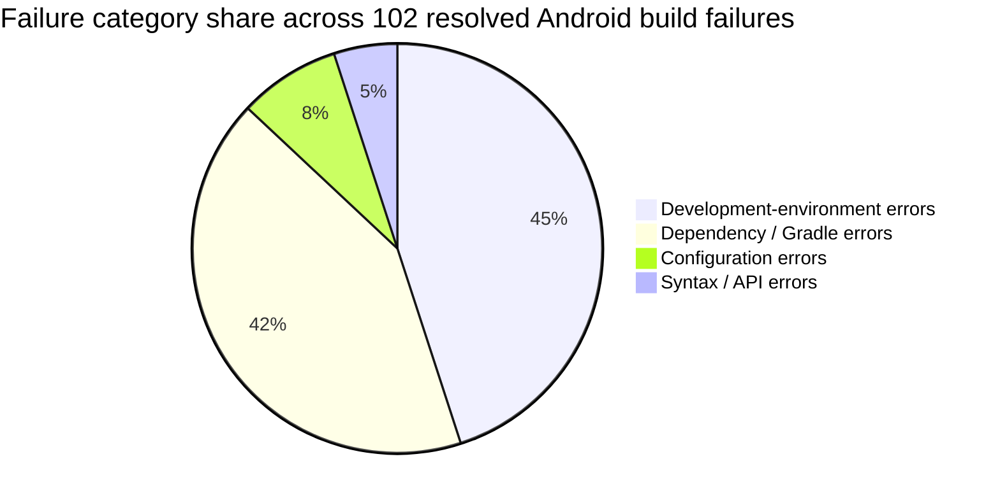
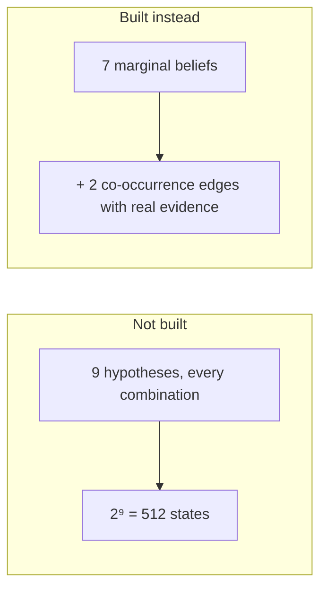
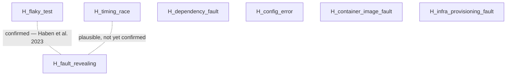
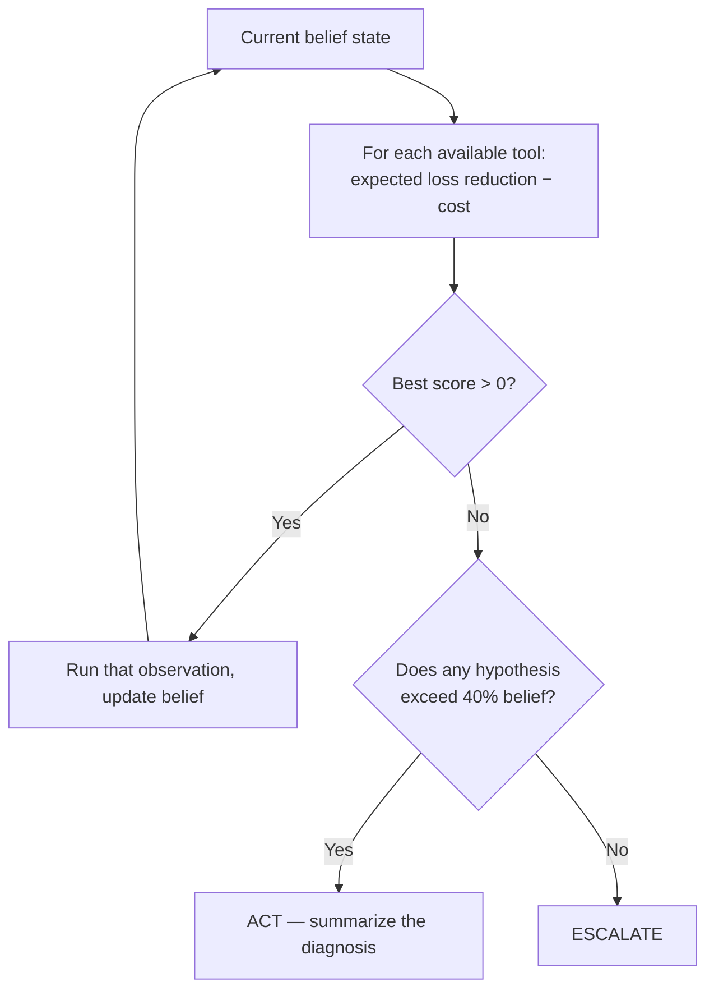
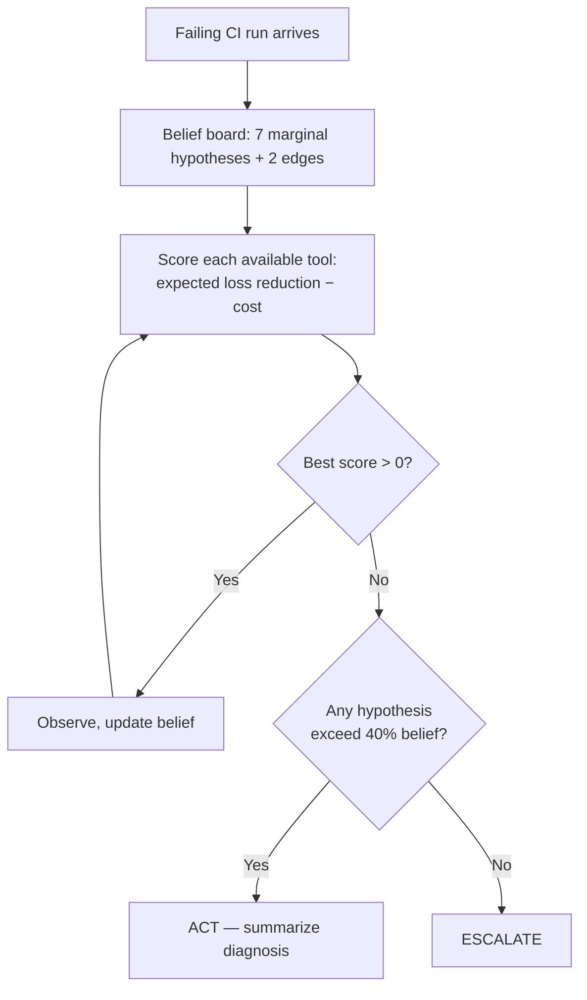

# CI Diagnosis Agent — Rough Research Notes

*Pre-build sanity check, before v1.*

## Problem Statement

> The agent observes a failing CI pipeline, forms a set of mutually exclusive hypotheses about what caused it, and gives the user a diagnosis when it's confident enough to.

## Goals

- Ground the hidden states in real, measured CI failure data — not just intuition.
- Work out what the agent needs to observe to reduce uncertainty.
- Decide what actions it's allowed to take.
- Land on a policy connecting belief to action.

## Methods

Research papers (for grounding the hidden-state list), Reddit threads (practitioner sanity check on the hypothesis board), blog posts / indie-dev write-ups on CI tooling.

---

## Part 1 — What Actually Causes CI Failures

- **LogSage** ([arXiv:2506.03691](https://arxiv.org/abs/2506.03691?utm_source=chatgpt.com)) — dumping the whole log into an LLM wastes tokens and increases hallucination. Agent should pick evidence by expected uncertainty reduction, not read everything.
- **"A Tale of CI Build Failures"** ([research.tudelft.nl](https://research.tudelft.nl/en/publications/a-tale-of-ci-build-failures-an-open-source-and-a-financial-organi/)) — 34,182 failing builds, open-source + a financial org. Failures span testing, compilation, dependency, deployment, release-prep, infra, and don't sort cleanly into one bucket each → keep several live hypotheses, don't force one label.
- **MSeer** (multi-bug fault localization) — a program can have more than one active bug; single-cause techniques break down when that's true. Same lesson, from the fault-localization side.
  - *Working assumption carried forward: events aren't mutually exclusive in the world, so P(A or B) = P(A) + P(B) − P(A ∩ B).*
- **"Programmers' Build Errors: A Case Study at Google"** — 90% of build errors trace to ~10% of possible problems. Skewed, not flat → 5–10 hidden states cover most of the mass for a baseline.
- **Android build-failure study**, ~200 OSS projects, 139 issue instances across 102 resolved failures:

A few categories dominate, and a single failure often implicates more than one category at once — same shape as the Google study, now with numbers behind it.

---

## Part 2 — From "One Cause" to a Hypothesis Board

**Starting hypothesis set:**

| Original | Refined into | Why |
|---|---|---|
| `H_flaky` | `H_flaky_test` vs. `H_timing_race` | Different fixes: pure non-determinism vs. a load-dependent race |
| `H_environment_fault` | `H_container_image_fault` vs. `H_infra_provisioning_fault` | Different owners: local image rebuild vs. a DevOps ticket |
| — | `H_fault_revealing` | Real codebase bug |
| — | `H_dependency_fault` | Missing/outdated/upstream-registry dependency issue |
| — | `H_config_error` | Bad env vars, CI YAML, secrets |
| — | `H_shared_root_cause` | Compound signal linking several simultaneously-failing tests |

**The problem:** VoI math wants mutually exclusive hypotheses, but modeling every combination of the ones above is 2⁹ = 512 states — not workable with a small labeled set.

**The fix:** keep marginal (independent) hypotheses, and only explicitly model the specific joint cases that have real evidence behind them. Drop the rest, on the assumption P(A and B) ≈ P(A) × P(B) where nothing suggests otherwise.

**The board, after Reddit discussion + more digging:**

| Edge | Status |
|---|---|
| `H_flaky_test` — `H_fault_revealing` | Confirmed. Haben et al. 2023: ~1/3 of regression faults had a flaky history. |
| `H_timing_race` — `H_fault_revealing` | Plausible by analogy, not directly confirmed. |

Dropped on purpose: `H_container_image_fault`×`H_infra_provisioning_fault` (different owners, no co-occurrence evidence), `H_dependency_fault`×`H_config_error` (plausible, no CI-specific source found).

*Flagging, not fixing: `H_shared_root_cause` is in the refined-hypothesis table but not one of the 7 marginals on the board — it's a cross-instance relationship (links multiple failing tests within one CI run), not a property of a single failure, so it doesn't fit as a peer node here. Haven't decided if it needs its own mechanism or is a v2 problem.*

---

## Part 3 — What the Agent Observes

Read-only. No test execution, no agent-triggered reruns, no CLI. What it can't see, it asks a human for.

| Tool / API | Observes | Evidence for | Why |
|---|---|---|---|
| Workflow Runs API — `GET .../actions/runs` | Pass/fail history for this workflow/branch/commit | `H_flaky_test`, cross-check for `H_shared_root_cause` | A single failing run can't distinguish flaky from real without history |
| Workflow Jobs API + logs — `GET .../jobs/{job_id}/logs` | Raw stdout/stderr, stack traces, timing | `H_dependency_fault`, `H_config_error`, `H_timing_race` | Confirmed live in GitHub's REST docs, read-only |
| Checks API — `GET .../commits/{ref}/check-runs` | Structured pass/fail + annotations | Same ground as logs, structured | Easier/more reliable than parsing free text |
| Compare API — `GET .../compare/{base}...{head}` | Diff between last-green and first-red | `H_fault_revealing`, `H_config_error` | Most information-dense observation available |
| Contents API — `GET .../contents/{path}` | Manifests, lockfiles, CI config on demand | `H_dependency_fault`, `H_config_error` | Diff shows a manifest changed; this shows the resolved tree |
| Pull Request API — `GET .../pulls/{number}` + comments | PR description, linked issues, review comments | `H_fault_revealing` vs. intentional incomplete work | Human-authored context, no other source |
| GitHub status page (public API) | Whether GitHub Actions was degraded at run time | `H_infra_provisioning_fault` | Only source that can rule GitHub's own outage in or out |
| Ask a human — `POST .../issues/{number}/comments` | Anything the above can't reach: registry state, cloud infra, secrets, intent | Whatever's left | No API keys, no cloud access — when the answer lives there, ask instead of guess |

Which tool gets called next isn't a fixed sequence — the agent ranks every available observation by expected loss reduction minus its cost, and picks whichever is highest given the *current* belief state. Cheap, structured signals tend to win early rounds because cost is subtracted directly, not because they're hardcoded first:

---

## Part 4 — Cost Analysis (for VoI)

| Cost item | Estimate | Source | Confidence |
|---|---|---|---|
| Asking a human to rerun a job | $0.006/min (Linux hosted runner) × duration | GitHub's 2026 runner pricing | High — published, measurable |
| False escalation / unnecessary interruption | ~23 min lost focus per instance | Gloria Mark (UC Irvine), interruption-cost research | Medium — general knowledge-work research, not CI-specific; anchor, not a real number yet |
| Wrongly calling a real fault "flaky/safe," worst case it ships and causes an outage | Ceiling only: ITIC 2024 (90%+ of mid/large enterprises report $300K+/hr downtime); Gartner's $5,600/min (2014) | ITIC 2024; Gartner 2014 | Low, deliberately |

That last one is a ceiling, not an expected cost — most shipped bugs get caught by monitoring/rollback before a full outage. The real number is `P(this wrong call → real outage) × outage cost`, and I don't have that probability. Not inventing one — planning to elicit it as a calibrated 90% CI from someone who'd know, not a point guess.

---

## Part 5 — Policy & Architecture

Baseline agent takes no autonomous action — it only reports. "Gathering more evidence" isn't a separate terminal move, it's just Part 3's loop running another round (asking a human is one of the tools in that loop, same as reading a log). Once that loop has nothing left worth its cost, there are exactly two ways out:

- **Act** — summarize the diagnosis, if some hypothesis clears 40% belief
- **Escalate** — hand off to a human, if nothing does

---

## Open Questions

- **Independence assumption** — P(A and B) ≈ P(A)×P(B) for most pairs, no edge modeled. Defensible for a baseline, or needs validating against labeled data first?
- **`H_shared_root_cause`** — in the hypothesis list, not on the board. First-class before v1, or fine to defer?
- **Downtime-cost ceiling** — used as an upper bound since I don't have the probability connecting a wrong call to an actual outage. Right way to handle not having that number, or is there a better bound for a baseline?
- **23-minute interruption cost** — real research, but general knowledge-work, not CI-specific. Worth a CI-specific number before v1, or fine to ship with the general anchor?
- **The 40% act/escalate threshold** — picked as a round number, not derived from a cost ratio. Should this come from the actual cost of a wrong diagnosis vs. the cost of an unnecessary escalation instead of a flat number?